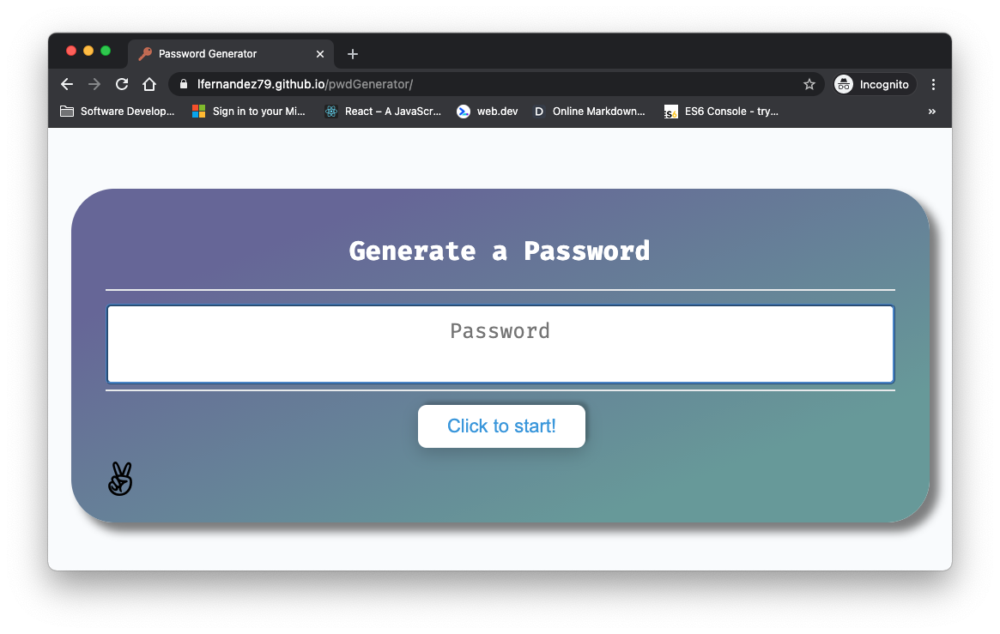
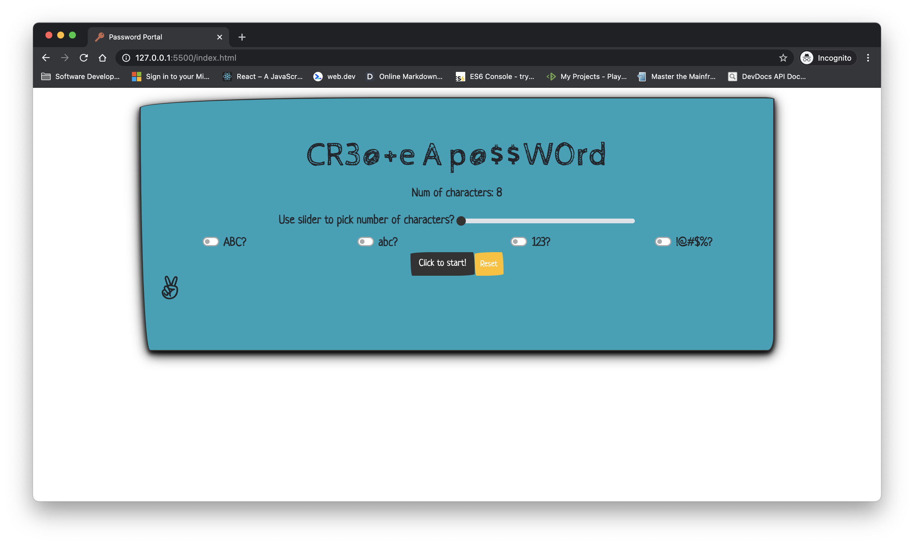
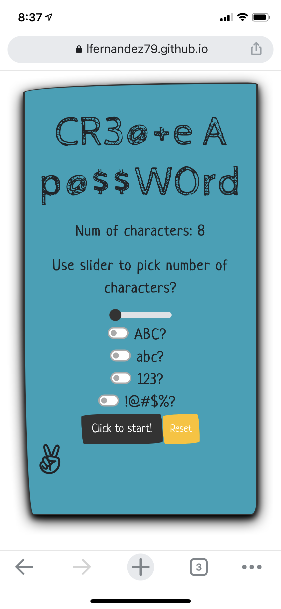

## Password Generator Portal


[](https://app.netlify.com/sites/pwdg/deploys)

Re-new and improved Javascript web-app that creates a random password based on user-selected criteria. This app runs in the browser and mobile devices feature dynamically updated. Clean and polished user interface and responsive. 

# [Launch it!](https://pwdg.netlify.app/)

## Technology

```sh
HTML
CSS
Boostrap
Bootswatch
Vanilla JavaScript
```
### Features 
* Timer
* Fontawesome
* Favicon
* Removed old alert questions for toggles.
* Complete migration to ES6
* Netlify 

  

| Dated app    | New and Improved => ES6 | Mobile device |
| -------------| ------------------------|---------------|
| v1           | v2                      | v2            |
|  | | |


#### Future
* Enable PWA
* Enable hsimp