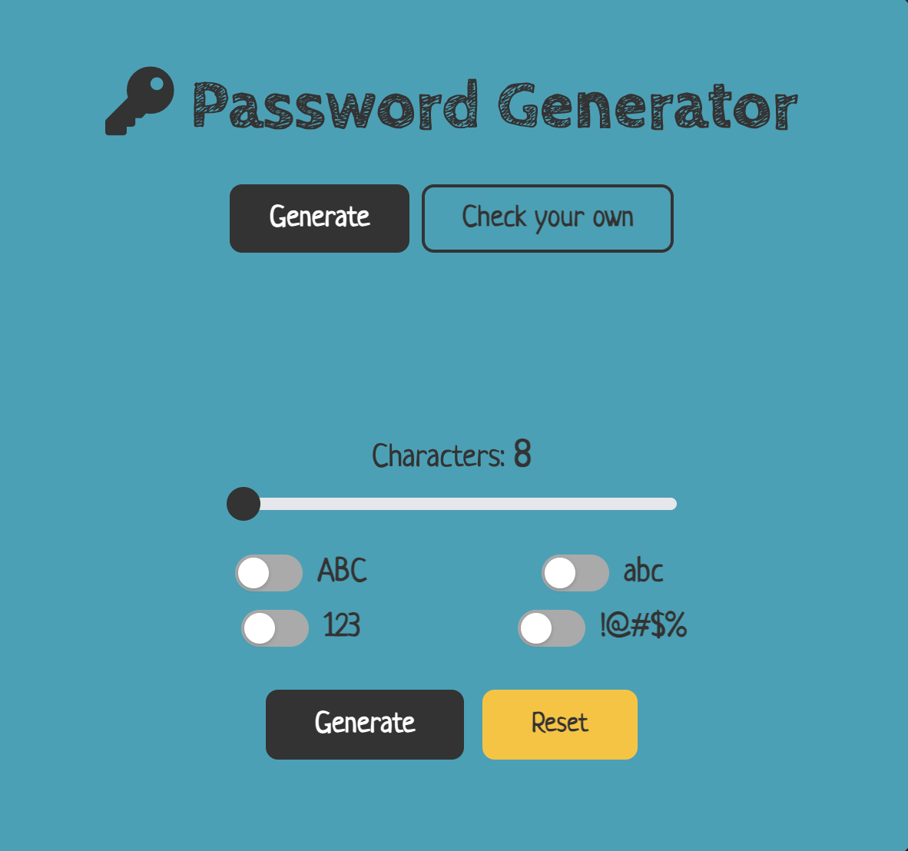
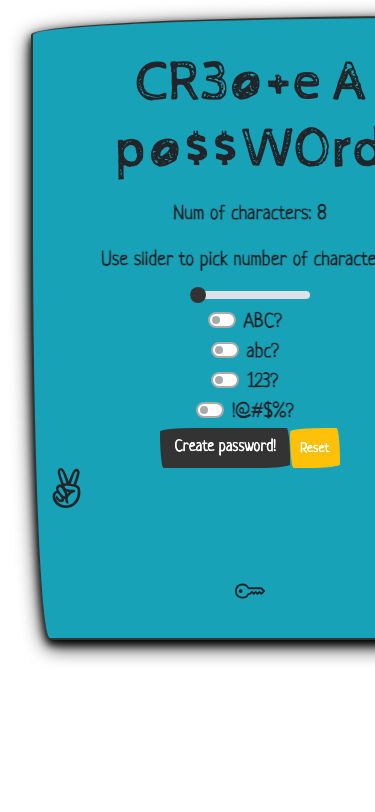

# Password Generator Portal

A vanilla JavaScript webapp that generates secure random passwords based on user-selected criteria. Runs in the browser — no backend, no dependencies, no build step.

## [Launch it!](https://pwdg.netlify.app/)

## Features

### Generate mode
- Cryptographically secure generation via `crypto.getRandomValues()`
- Adjustable length (8–30 characters)
- Selectable character types: uppercase, lowercase, numbers, symbols
- Password strength estimate — shows how long an offline attacker would take to crack the result
- One-click copy to clipboard
- 10-second auto-clear countdown

### Check your own mode
- Paste any password to see its strength and estimated crack time
- Live tips for what's missing (length, uppercase, lowercase, numbers, symbols)
- "Suggest stronger version" button generates a leet-substituted, length-padded variant of your input — different result on every click

### General
- Accessible (ARIA live regions, labeled controls, tabbed navigation)
- PWA-ready (Add to Home Screen on mobile)

## Tech Stack

- HTML5, CSS3, vanilla JavaScript (ES module)
- Font Awesome icons
- Deployed on Netlify (auto-deploy from `master`)

## Screenshots

| Desktop | Mobile |
|---------|--------|
|  |  |

## License

[MIT](LICENSE)
