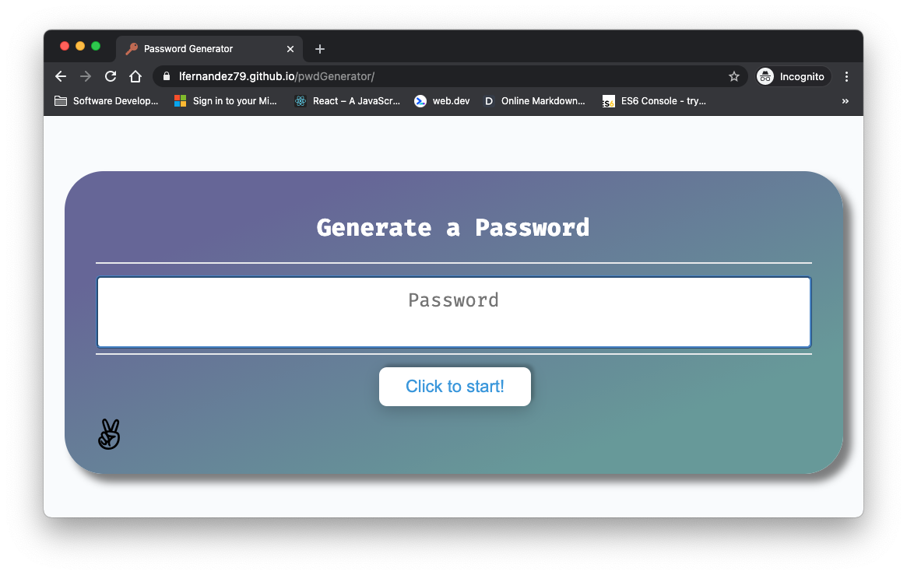
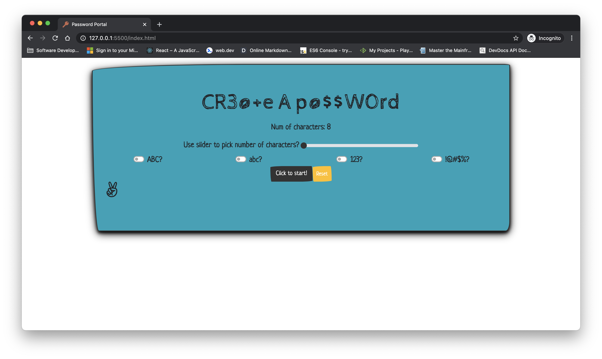
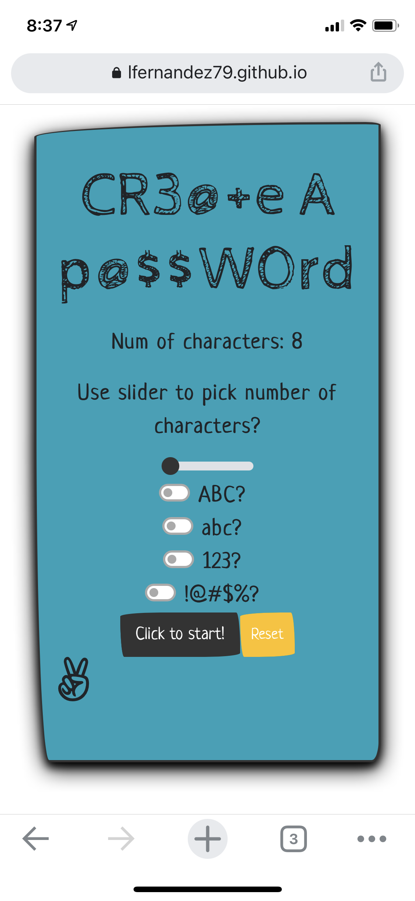

# Password Generator Portal

A vanilla JavaScript webapp that generates secure random passwords based on user-selected criteria. Runs in the browser — no backend, no dependencies, no build step.

## [Launch it!](https://pwdg.netlify.app/)

## Features

- Cryptographically secure generation via `crypto.getRandomValues()`
- Adjustable length (8–30 characters)
- Selectable character types: uppercase, lowercase, numbers, symbols
- One-click copy to clipboard
- 10-second auto-clear countdown
- Accessible (ARIA live regions, labeled controls)
- PWA-ready (Add to Home Screen on mobile)

## Tech Stack

- HTML5, CSS3, vanilla JavaScript (ES module)
- Bootstrap 4.6.0 + Bootswatch theme
- Font Awesome icons
- Deployed on Netlify (auto-deploy from `master`)

## Screenshots

| v1 | v2 | Mobile |
|----|-----|--------|
|  |  |  |

## License

MIT
